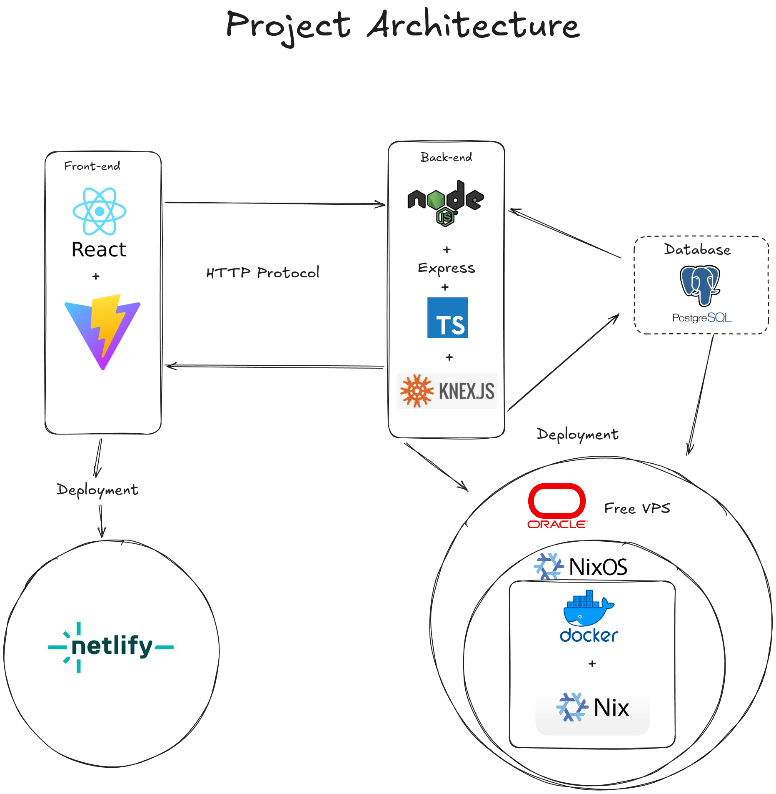

# Portfolio & Personal Blog

A sophisticated full-stack web application that serves as both a professional portfolio showcase and a technical blog platform. Built with modern technologies, comprehensive documentation, and **Nix-based reproducible development environments** for seamless developer onboarding.

## Project Overview

This is a comprehensive portfolio and personal blog platform that demonstrates advanced web development skills through:

- **Multi-language Support**: English and Spanish content with seamless switching
- **Responsive Design**: Mobile-first approach with multiple theme options
- **Modern Architecture**: Clean separation of concerns with robust documentation
- **Reproducible Development**: Nix-based development environments for zero-setup onboarding
- **Professional Portfolio**: Project showcase with live demos and source code links
- **Technical Blog**: Knowledge sharing through well-organized blog posts

## 🔧 Nix Development Environment

This project features **reproducible Nix development shells** that eliminate manual setup and ensure consistent environments across all developers. No need to install Node.js, PostgreSQL, or configure environment variables manually.

### Available Development Shells

| Shell        | Purpose                        | Tools Included                                   | Environment Variables                                     |
| ------------ | ------------------------------ | ------------------------------------------------ | --------------------------------------------------------- |
| **Backend**  | Full-stack backend development | Node.js, PostgreSQL, TypeScript, Prettier, Biome | Pre-configured database credentials, development settings |
| **Frontend** | Frontend development           | Node.js, Prettier, Biome                         | Optimized for frontend workflow                           |

### Key Benefits

- **🚀 Zero Setup**: New developers can start coding in minutes, not hours
- **🔄 Reproducibility**: Identical environments across all machines and platforms
- **📦 Version Consistency**: Fixed Node.js, PostgreSQL, and tool versions
- **🛡️ Isolation**: No system-wide package conflicts or version mismatches
- **⚡ Integrated Database**: Built-in PostgreSQL management with external flake

### Database Management Apps

The flake provides convenient database management commands:

- **Start Database**: `nix run .#db-start` - Launch PostgreSQL service
- **Stop Database**: `nix run .#db-stop` - Shutdown PostgreSQL service
- **Reset Database**: `nix run .#db-reset` - Fresh database with clean slate

### Quick Commands

```bash
# Enter backend development environment
nix develop .#Backend

# Enter frontend development environment
nix develop .#Frontend

# Build backend as Nix package
nix build .#Backend

# Run backend directly (after build)
nix run .#Backend
```

**Getting Started with Nix** requires [installing Nix with flakes](https://nixos.org/download.html) enabled. Once installed, you have instant access to a complete development environment without any additional setup.

## Architecture Overview

The application follows a modern three-tier architecture with comprehensive documentation:

```
┌─────────────────┐    ┌─────────────────┐    ┌─────────────────┐
│   Front-End    │    │    Back-End    │    │    Database    │
│   (React)       │◄──►│   (Express.js)  │◄──►│  (PostgreSQL)  │
├─────────────────┤    ├─────────────────┤    ├─────────────────┤
│ • Multi-language │    │ • RESTful API   │    │ • Multilingual  │
│ • Theme System  │    │ • Security      │    │ • Migrations    │
│ • Components    │    │ • Rate Limiting │    │ • Seeding       │
└─────────────────┘    └─────────────────┘    └─────────────────┘
```



## Documentation Structure

This project maintains comprehensive, architecture-focused documentation organized by component:

### Front-End Documentation ([`docs/front-end/`](./docs/front-end/))

**React-based user interface with modern web standards**

| Document                                                 | Focus                 | Key Topics                                           |
| -------------------------------------------------------- | --------------------- | ---------------------------------------------------- |
| [Architecture](./docs/front-end/ARCHITECTURE.md)         | System design         | Component architecture, state management, routing    |
| [Components](./docs/front-end/COMPONENTS.md)             | UI components         | Reusable components, prop interfaces, usage patterns |
| [State Management](./docs/front-end/STATE-MANAGEMENT.md) | Data flow             | Custom hooks, localStorage, API state management     |
| [Styling system](./docs/front-end/STYLING-SYSTEM.md)     | Visual design         | CSS architecture, theming, responsive design         |
| [API Integration](./docs/front-end/API-INTEGRATION.md)   | Backend communication | API calls, error handling, data fetching             |

### Back-End Documentation ([`docs/back-end/`](./docs/back-end/))

**Node.js/Express RESTful API with security focus**

| Document                                                              | Focus                  | Key Topics                                            |
| --------------------------------------------------------------------- | ---------------------- | ----------------------------------------------------- |
| [Architecture](./docs/back-end/ARCHITECTURE.md)                       | System architecture    | Layered design, security patterns, scalability        |
| [API Reference](./docs/back-end/API-REFERENCE.md)                     | Endpoint documentation | RESTful endpoints, request/response formats, examples |
| [Controller Architecture](./docs/back-end/CONTROLLER-ARCHITECTURE.md) | Request handling       | Controllers, validation, business logic               |
| [Repository Pattern](./docs/back-end/REPOSITORY-PATTERN.md)           | Data access            | Repository pattern, query optimization, data mapping  |
| [Configuration Security](./docs/back-end/CONFIGURATION-SECURITY.md)   | Setup & security       | Environment config, rate limiting, security headers   |
| [Deployment](./docs/back-end/DEPLOYMENT.md)                           | Production deployment  | Docker, Nginx, SSL, monitoring                        |

### Database Documentation ([`docs/database/`](./docs/database/))

**PostgreSQL database with advanced multilingual architecture**

| Document                                                          | Focus               | Key Topics                                            |
| ----------------------------------------------------------------- | ------------------- | ----------------------------------------------------- |
| [Database Architecture](./docs/database/DATABASE-ARCHITECTURE.md) | Database design     | Schema patterns, relationships, Knex.js integration   |
| [Database Schema](./docs/database/DATABASE-SCHEMA.md)             | Table definitions   | Complete schema, constraints, indexing, relationships |
| [Migration System](./docs/database/MIGRATION-SYSTEM.md)           | Schema evolution    | Version control, migrations, rollback procedures      |
| [Seed System](./docs/database/SEED-SYSTEM.md)                     | Data initialization | Test data, environment-specific seeding, validation   |

## Key Features

### Multilingual Portfolio

- **Dual Language Support**: Complete English and Spanish implementations
- **Persistent Preferences**: Language choice saved across sessions
- **Consistent Translation**: All content available in both languages

### Advanced Theming System

- **Multiple Themes**: Gruvbox (Light/Dark), Catppuccin (Mocha/Latte)
- **Dynamic Switching**: Real-time theme changes without page reload
- **Responsive Adaptation**: Mobile-first design that adapts to all screen sizes

### Technical Blog

- **Tag-Based Organization**: Advanced categorization system
- **Search Functionality**: Find content by title or tags
- **Content Management**: Dynamic loading with error handling
- **Performance Optimized**: Efficient content retrieval and caching

### Professional Portfolio

- **Project Showcase**: Detailed project descriptions with live demos
- **Source Code Links**: Direct access to GitHub repositories
- **Skills Display**: Technology stack and skill representation
- **Contact Integration**: Professional contact information

### Security & Performance

- **Rate Limiting**: Protection against abuse with progressive delays
- **Input Validation**: Comprehensive parameter validation and sanitization
- **Security Headers**: OWASP-compliant security implementation
- **Performance Optimization**: Efficient queries, connection pooling, caching

## Technology Stack

### Front-End

- **Framework**: React 19.2.0 with modern hooks
- **Routing**: React Router DOM 7.12.0 for navigation
- **Build Tool**: Vite 7.2.4 for fast development and building
- **Styling**: Vanilla CSS with custom properties for theming
- **Language**: JavaScript ES6+ with modern features

### Back-End

- **Runtime**: Node.js with TypeScript for type safety
- **Framework**: Express.js 5.2.1 for RESTful API development
- **Security**: Helmet.js, CORS, Express Rate Limiter
- **Database**: PostgreSQL with Knex.js query builder

### Database

- **Engine**: PostgreSQL for robust relational data storage
- **Migration**: Knex.js migrations for schema version control
- **Seeding**: Comprehensive seed data for development and testing
- **Architecture**: Multilingual support with translation tables

## Quick Start

### 🚀 Recommended: Nix Development Environment (Zero Setup)

**Prerequisites**: Nix with flakes enabled ([installation guide](https://nixos.org/download.html))

```bash
# Clone repository
git clone <repository-url>
cd Portfolio

# Start PostgreSQL database (one-time setup)
nix run .#db-start

# Setup backend (automatically installs dependencies, runs migrations, and seeds)
nix develop .#Backend -- npm install && npm run migrate:latest && npm run seeds:run

# Start development servers
# Terminal 1 - Back-end (in Nix environment)
nix develop .#Backend -- npm run dev

# Terminal 2 - Frontend (in Nix environment)
nix develop .#Frontend -- npm run dev
```

### 🔄 Alternative: Traditional Manual Setup

**Prerequisites**: Node.js 18+, PostgreSQL 12+, modern web browser

```bash
# Clone repository
cd Portfolio

# Install dependencies (run in both directories)
cd back-end && npm install
cd ../front-end && npm install

# Setup database (requires manual PostgreSQL configuration)
cd ../back-end

npm run migrate:latest
npm run seeds:run

# Start development servers
npm run dev

# Terminal 2 - Front-end
cd ../front-end
npm run dev
```

### Access Points

- **Front-End**: http://localhost:5173
- **Back-End API**: http://localhost:3000 || your configuration port

### Development Environment Commands

```bash
# Enter backend development shell
nix develop .#Backend

# Enter frontend development shell
nix develop .#Frontend

# Database management
nix run .#db-start    # Start PostgreSQL
nix run .#db-stop     # Stop PostgreSQL
nix run .#db-reset    # Reset database

# Build backend as Nix package
nix build .#Backend

# Run backend (after build)
nix run .#Backend
```

## 📋 Development Workflow

### For Front-End Development

1. Study [Front-End Architecture](./docs/front-end/ARCHITECTURE.md)
2. Review [Component Catalog](./docs/front-end/COMPONENTS.md)
3. Understand [State Management](./docs/front-end/STATE-MANAGEMENT.md)
4. Follow [Styling Guidelines](./docs/front-end/STYLING-SYSTEM.md)

### For Back-End Development

1. Understand [Back-End Architecture](./docs/back-end/ARCHITECTURE.md)
2. Review [API Reference](./docs/back-end/API-REFERENCE.md)
3. Study [Controller Patterns](./docs/back-end/CONTROLLER-ARCHITECTURE.md)
4. Learn [Repository Implementation](./docs/back-end/REPOSITORY-PATTERN.md)

### For Database Management

1. Review [Database Architecture](./docs/database/DATABASE-ARCHITECTURE.md)
2. Study [Schema Details](./docs/database/DATABASE-SCHEMA.md)
3. Learn [Migration System](./docs/database/MIGRATION-SYSTEM.md)
4. Understand [Seed System](./docs/database/SEED-SYSTEM.md)

## 🔧 Configuration

### Environment Variables

Expose the Enviroment Variables in your Path in respective directories:

**Back-End**

```bash
ENV_MODE=development
API_PORT=3000
DB_HOST=localhost
DB_PORT=5432
DB_NAME=portfolio_db
DB_USER=your_username
DB_PASS=your_password
```

**Front-End Configuration**

- API endpoints: `src/App.jsx`
- Color schemes: `src/style/colorschemes.css`
- Language texts: Component-level text objects

## 🚀 Deployment

### Production Deployment

1. **Database Setup**: Configure PostgreSQL database
2. **Back-End**: Follow [Deployment Guide](./docs/back-end/DEPLOYMENT.md)
3. **Front-End**: Build and serve static files
4. **Reverse Proxy**: Configure Nginx with SSL

## 📈 Performance

### Optimization Features

- **Code Splitting**: Lazy loading for better initial load times
- **Image Optimization**: Compressed images in public folder
- **Database Indexing**: Optimized queries for fast content retrieval
- **Connection Pooling**: Efficient database connection management
- **Caching**: Strategic caching for frequently accessed data

## 🔒 Security

### Implemented Security Measures

- **Rate Limiting**: 100 requests per 15 minutes per IP
- **Input Validation**: Comprehensive parameter validation
- **SQL Injection Prevention**: Parameterized queries
- **XSS Protection**: Input sanitization and output encoding
- **Security Headers**: OWASP-compliant headers
- **HTTPS Enforcement**: Secure communication protocols

## 🤝 Contributing

### Development Guidelines

1. **Follow Architecture**: Adhere to documented patterns
2. **Write Tests**: Include tests for new features
3. **Update Documentation**: Keep docs current with changes
4. **Code Quality**: Follow ESLint and TypeScript guidelines

### Documentation Standards

- **Comprehensive Coverage**: Document all architectural decisions
- **Practical Examples**: Include code samples and use cases
- **Cross-References**: Link between related documentation
- **Regular Updates**: Maintain documentation accuracy

## 📞 Support

### Documentation Resources

- **Architecture Questions**: Check respective architecture documents
- **API Reference**: [Back-End API Docs](./docs/back-end/API-REFERENCE.md)
- **Database Schema**: [Database Documentation](./docs/database/DATABASE-SCHEMA.md)
- **Front-End Components**: [Component Catalog](./docs/front-end/COMPONENTS.md)

### Getting Help

- **Issues**: Report bugs and feature requests in repository issues
- **Questions**: Use repository discussions for general questions
- **Documentation**: Report documentation issues for improvements

---

## 📋 Current Tasks

- [ ] Implement a Environment variables verification for the backend
- [ ] Add a was useful button to the Blogs
- [ ] Implement full-text search functionality for blogs
- [ ] Implement automated testing pipeline

---
