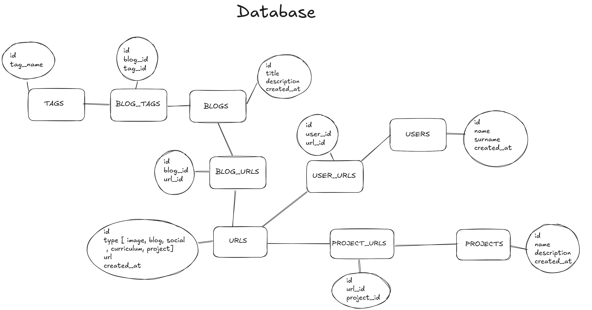

# Database Information

In the project we will be using PostgreSQL as database with the following Scheme:

You can find the `sql file`here:

[Database SQL file](./database-scheme.sql)

## Database Dictionary

### Custom Types

**Type Name:** `url_type`
**Values:** 'IMAGE', 'BLOG', 'SOCIAL', 'CURRICULUM', 'PROJECT'

### Tables

#### urls

| Name       | Type      | Nullable | Key | Default           | Extra |
| :--------- | :-------- | :------- | :-- | :---------------- | :---- |
| id         | SERIAL    | NO       | PK  | -                 | -     |
| type       | url_type  | NO       | -   | -                 | -     |
| url        | TEXT      | NO       | -   | -                 | -     |
| created_at | TIMESTAMP | YES      | -   | CURRENT_TIMESTAMP | -     |

#### projects

| Name        | Type         | Nullable | Key | Default           | Extra |
| :---------- | :----------- | :------- | :-- | :---------------- | :---- |
| id          | SERIAL       | NO       | PK  | -                 | -     |
| name        | VARCHAR(100) | NO       | -   | -                 | -     |
| description | TEXT         | NO       | -   | -                 | -     |
| created_at  | TIMESTAMP    | YES      | -   | CURRENT_TIMESTAMP | -     |

#### project_urls

| Name       | Type | Nullable | Key    | Default | Extra            |
| :--------- | :--- | :------- | :----- | :------ | :--------------- |
| project_id | INT  | NO       | PK, FK | -       | REF projects(id) |
| url_id     | INT  | NO       | PK, FK | -       | REF urls(id)     |

#### users

| Name       | Type        | Nullable | Key | Default           | Extra |
| :--------- | :---------- | :------- | :-- | :---------------- | :---- |
| id         | SERIAL      | NO       | PK  | -                 | -     |
| name       | VARCHAR(50) | NO       | -   | -                 | -     |
| surname    | VARCHAR(50) | NO       | -   | -                 | -     |
| created_at | TIMESTAMP   | YES      | -   | CURRENT_TIMESTAMP | -     |

#### user_urls

| Name    | Type | Nullable | Key    | Default | Extra         |
| :------ | :--- | :------- | :----- | :------ | :------------ |
| user_id | INT  | NO       | PK, FK | -       | REF users(id) |
| url_id  | INT  | NO       | PK, FK | -       | REF urls(id)  |

#### blogs

| Name        | Type         | Nullable | Key | Default           | Extra |
| :---------- | :----------- | :------- | :-- | :---------------- | :---- |
| id          | SERIAL       | NO       | PK  | -                 | -     |
| title       | VARCHAR(100) | NO       | -   | -                 | -     |
| description | VARCHAR(300) | NO       | -   | -                 | -     |
| created_at  | TIMESTAMP    | YES      | -   | CURRENT_TIMESTAMP | -     |

#### tags

| Name     | Type        | Nullable | Key    | Default | Extra |
| :------- | :---------- | :------- | :----- | :------ | :---- |
| id       | SERIAL      | NO       | PK     | -       | -     |
| tag_name | VARCHAR(50) | NO       | UNIQUE | -       | -     |

#### blog_tags

| Name    | Type | Nullable | Key    | Default | Extra         |
| :------ | :--- | :------- | :----- | :------ | :------------ |
| blog_id | INT  | NO       | PK, FK | -       | REF blogs(id) |
| tag_id  | INT  | NO       | PK, FK | -       | REF tags(id)  |

#### blog_urls

| Name    | Type | Nullable | Key    | Default | Extra         |
| :------ | :--- | :------- | :----- | :------ | :------------ |
| blog_id | INT  | NO       | PK, FK | -       | REF blogs(id) |
| url_id  | INT  | NO       | PK, FK | -       | REF urls(id)  |

